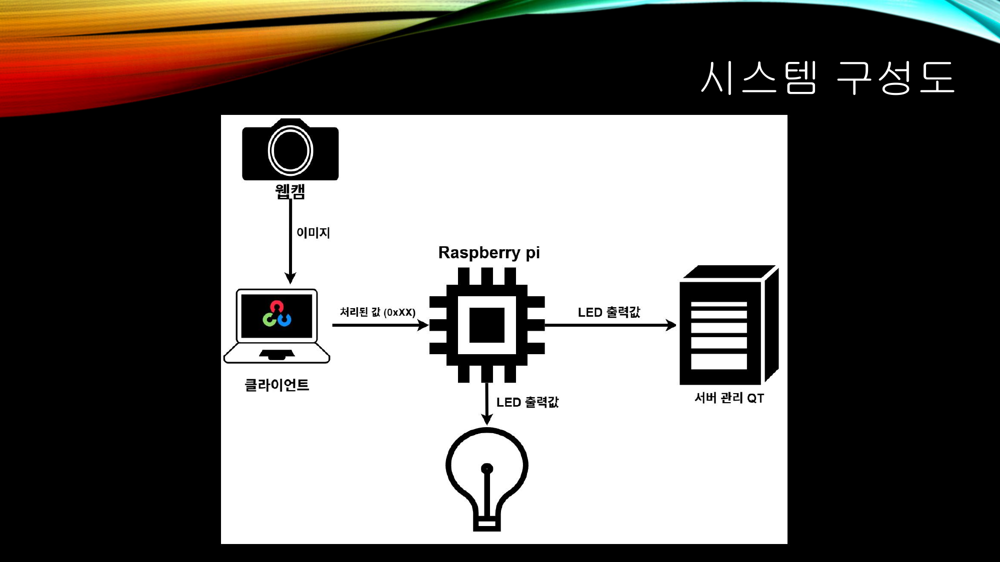
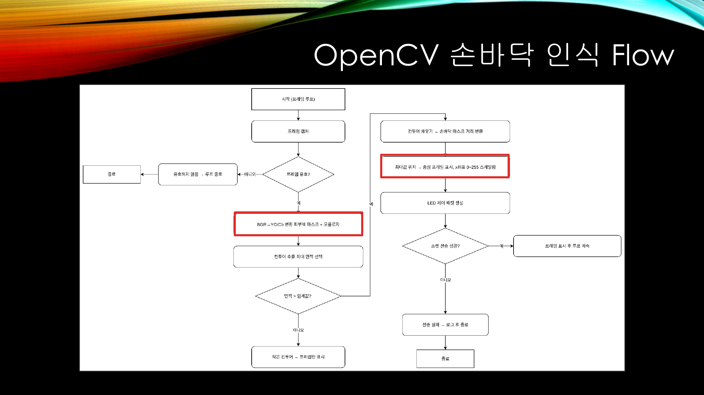
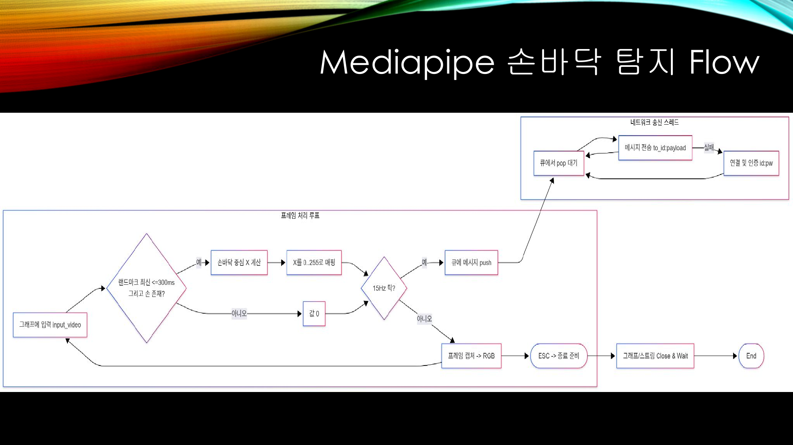
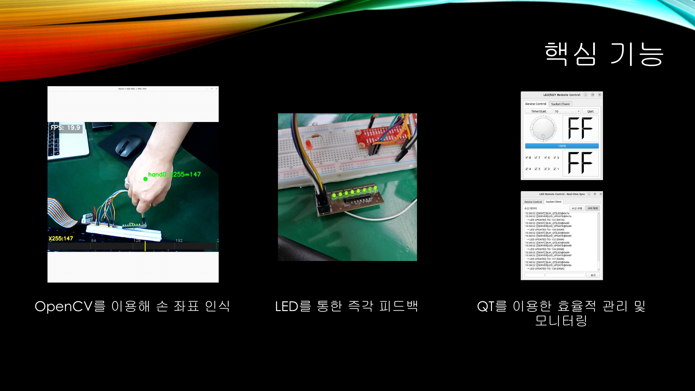

# 인텔 7기 비전 미니 프로젝트 8팀 : 손 추적으로 LED 제어
1. 카메라로 손바닥 중심의 X 좌표를 실시간 추정해 0~255 값으로 매핑
2. TCP 서버를 통해 물리 LED 바(또는 UI)에 반영하는 End‑to‑End 데모
3. MediaPipe OR OpenCV로 손을 추적
4. Socket 서버가 여러 클라이언트(예: Qt UI, 비전 클라이언트) 간 메시지 브로드캐스트
5. 커널 모듈을 통해 실제 LED 장치를 제어

## 아키텍처 개요
- 비전 클라이언트(`src/mediapipe/`)
  - 카메라 프레임에서 손 랜드마크를 추정
  - 손바닥 중심의 X 좌표를 0~255로 변환
  - 15Hz로 `LED@0xNN` 형태의 값을 서버로 송신
- LED 서버(`src/rsp_server/`)
  -  TCP 접속/브로드캐스트 처리
  -  수신한 `LED@...` 값을 물리 LED로 출력
  -  모든 클라이언트에 `[SERVER]LED_UPDATE@...` 알림 전송
- Qt 클라이언트(`src/qt/`)
  - 서버에 접속해 로그 표시 및 LED 값 송수신 UI 제공
- 하드웨어
  - 문자 디바이스(`/dev/ledkey`)용 간단한 커널 모듈(`ledkey_simple_dev.ko`)로 8‑LED 바 제어

## 주요 기능
- 손 추적 기반 실시간 제어: 30FPS 입력, 15Hz로 LED 업데이트 콜백
- 간단한 프로토콜과 브로드캐스트: 다수 클라이언트 동시 접속/동기화
- 하드웨어/시뮬레이션 겸용: 디바이스 부재 시 콘솔 출력 기반 시뮬레이션

## 시연 영상

위 이미지를 클릭하면 YouTube 시연 영상으로 이동합니다.

## 발표 자료

- 시스템 구성도 (PDF 5페이지)

  

- OpenCV 손바닥 인식 Flow (PDF 6페이지)

  

- Mediapipe 손바닥 탐지 Flow (PDF 7페이지)

  

- 핵심 기능 (PDF 8페이지)

  

원본 PDF: 발표자료/손은 눈보다 빠르다 발표자료.pdf (GitHub에서 페이지 이동은 브라우저에 따라 `#page=5` 등의 앵커가 동작하지 않을 수 있습니다.)

## 메시지 프로토콜(요약)
- 로그인: 클라이언트 접속 직후 1행 전송. 예) `[<id>:<pw>]` 또는 `<id>:<pw>`
- LED 명령: `LED@0xNN` 또는 `LED@<10진수>` (예: `LED@0x7F`)
- 브로드캐스트: 서버는 수신 메시지를 다른 클라이언트에 중계하고, 하드웨어 반영 후 `[SERVER]LED_UPDATE@0xNN` 공지 전송
- 비전 클라이언트의 전송 형식: `<to_id>:LED@0xNN\n` (예: `2:LED@0x64`)

## 하드웨어 구성
- 커널 모듈: `src/rsp_server/ledkey_simple_dev.c` → `make install`로 로드 후 `/dev/ledkey` 사용
- 패턴 매핑: `0~255` 값을 8단계로 나누어 8‑LED를 누적 점등(`src/rsp_server/ledkey_server.c`의 `value_to_led_pattern` 참조)

## 리포지토리 구성
- `src/mediapipe/`: 손 추적 로직(C++), 네트워크 전송, MediaPipe 그래프 사용
- `src/rsp_server/`: LED 서버(C), 커널 모듈 및 Makefile
- `src/qt/`: Qt 기반 GUI 클라이언트
- `src/opencv_ws/`: OpenCV 실험 코드 모음
- `tools/generate_readme.py`: 자동 요약 섹션 생성 스크립트

아래 자동 생성 섹션에는 디렉토리 트리와 파일 요약이 포함됩니다.

## 참고
- MediaPipe: https://github.com/google-ai-edge/mediapipe
- OpenCV: https://opencv.org/
- OpenCV 손바닥 참고 예제 : https://blog.naver.com/pckbj123/100203324561
